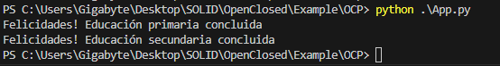

## Open-Closed Principle

### Definición

El principio Open-Closed es el segundo de los principios SOLID e indica que una entidad debe estar abierta a la extensión y cerrada a la modificación. Esto quiere decir que queremos poder agregar nuevas características o funcionalidades a nuestro código fácilmente, pero sin cambiar el código que ya hemos escrito. 

Este principio es uno de los más importantes y al mismo tiempo el más difícil de cumplir debido a su caracter contradictorio (una entidad abierta y cerrada al mismo tiempo). 

Para implementar este principio, nos apoyamos fuertemente en la abstracción y polimorfismo ya que esto nos permite agregar nuevos comportamientos sin necesidad de modificar código, solamente extendemos.

### Ejemplo

En el siguiente codigo ([StudenteNoOPC](Example/NoOCP/StudentNoOPC.py)) creamos una clase estudiante que puede graduarse de distintos niveles de educación:

```python
from enum import Enum

class Level(Enum):
    PRIMARIA = 0
    SECUNDARIA = 1

class StudentNoOPC():
    def __init__(self):
        pass
    
    def graduate(level):
        # Graduate according to education level
        if(level == Level.PRIMARIA.value):
            print("Educación primaria concluida")
        elif(level == Level.SECUNDARIA.value):
            print("Educación secundaria concluida")
```
Esta clase no sigue el principio Open-Closed. Digamos que necesitamos agregar un nivel educativo adicional que podría ser preescolar, técnico o superior. Agregar cualquiera de estos niveles (abierto a la extensión) implica agregar un nuevo condicional al método graduate y esto rompe con la parte Closed del principio: la clase debe estar cerrada a las modificaciones.  

Para solucionar este problemas se propone la siguiente [solución](Example/OCP) . 

* Abstraer la clase Level
```python
# Abstract class
class Level():
    def __init__(self) -> None:
        pass
    def graduate():
        pass
```
* Implementar los niveles por separado

*   * Primaria 

``` python
from Level import Level

class Primaria(Level):

    def graduate(self):
        return "Educación primaria concluida"
```
*   *   Secundaria

```python
from Level import Level

class Secundaria(Level):

    def graduate(self):
        return "Educación secundaria concluida"
```

* Clase estudiante abierta a la extensión

```python
import Level

class Student():
    def __init__(self) -> None:
        pass
    def graduate(self, level: Level):
        # graduate according to education level
        print(f"Felicidades! {level.graduate()}")
```

De esta manera podemos agregar más niveles (abierto a la expansión) sin tener que modificar la clase estudiante (cerrado a la modificación)

*  Aplicación

```python
from Student import Student
from Primaria import Primaria
from Secundaria import Secundaria

class App():
    def __init__(self):
        pass

    def graduateStudent(self):
        student = Student()

        primaria = Primaria()
        student.graduate(primaria)

        secundaria = Secundaria()
        student.graduate(secundaria)

app = App()
app.graduateStudent()
```
### Ejecución del ejemplo

```bash
cd Example/OCP/
python App.py 
```


