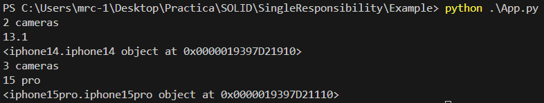

## Single Responsibility Principle

### Definición

El principio Single Responsibility es el primero de los principios SOLID e indica que una clase solamente debe cambiar por una única rázon, de esta manera se elimina la dependencia o posibilidad de "romper" otras partes del código. 

Para implementar este principio, debemos juntar las cosas que cambiar por el mismo motivo y separar las que no.

### Ejemplo

Analicemos una situación en la que una clase está encargada de construir y montar distintos objetos complejos. Si la manera de construirlos cambia, la clase tiene que cambiar. Pero si la manera de montarlos cambia, la clase tiene que cambiar también. Esto significa que tiene 2 motivos para cambiar y eso va en contra del principio en el que cada clase debe tener una única responsabilidad.

Entonces podemos solucionar este problema implementando el patrón builder. Este patrón delega la construcción a los builders y el montaje al director. Dejando así una sola responsabilidad a cada clase. 

En este ejemplo implementamos el patrón builder para la construcción y montajes de iPhones 14 y 15 pro. Las clases toman las siguientes responsabilidades.

* iphone14builder y iphone15probuilder
    * Definen la construcción de los iPhone
```python
from iphonebuilder import iphonebuilder
from iphone14 import iphone14

class iphone14builder(iphonebuilder):
    phone = None
        
    def __init__(self):
        self.reset()

    def reset(self):
        self.phone = iphone14()

    def setCameras(self):
        print("2 cameras")

    def setSize(self):
        print("13 cm x 5 cm")

    def series(self):
        print("13.1")

    def getIphone(self):
        return self.phone
```

* Director
    * Define el montaje de cada iphone. Se puede notar que si la construcción cambia, esta clase no se ve afectada    
 ```python
from iphonebuilder import iphonebuilder

class Director:

    def __init__(self):
        pass

    def buildiphone14(self, builder : iphonebuilder):
        builder.reset()
        builder.setCameras()
        builder.series()

    def buildiphone15pro(self, builder : iphonebuilder):
        builder.reset()
        builder.setCameras()
        builder.series()
```

### Ejecución del ejemplo

```bash
md Example/ 
python App.py 
```

